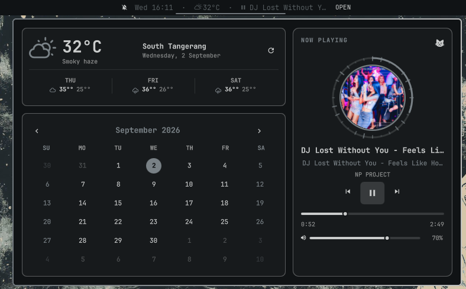

# Celestune Bar for Omarchy

A unified Omarchy bar widget containing a calendar, weather summary and
forecast, and MPRIS media controls. Celestune Bar is built natively for
Omarchy: weather comes from Omarchy's weather panel, and media is read
directly from Quickshell's MPRIS service (players like Spotify, Sonora,
browsers, etc.).



## Features

- Current weather and a three-day forecast.
- Monthly calendar with today highlighting.
- MPRIS album art, track details, playback controls, seek, and volume.
- Compact bar label combining time, weather, and the active track.
- Theme-aware styling using Omarchy Shell colors and spacing.

## Requirements

- Omarchy Shell with its built-in weather panel.
- An MPRIS-compatible player for media information and controls.

Celestune Bar requires no additional system packages or privileged access.

## Installation

```bash
omarchy plugin add https://github.com/FlipZ3ro/celestune-bar.git --enable
```

Celestune Bar is placed in the center section by default. You can reposition
it through Omarchy's bar configuration.

## Controls

- Left click: open or close the dashboard.
- Middle click: play or pause media.
- Right click: refresh weather.
- Scroll: previous or next track.

## Removal

```bash
omarchy plugin remove celestune-bar
```

## License

Celestune Bar is licensed under the GNU General Public License v3.0 only.
